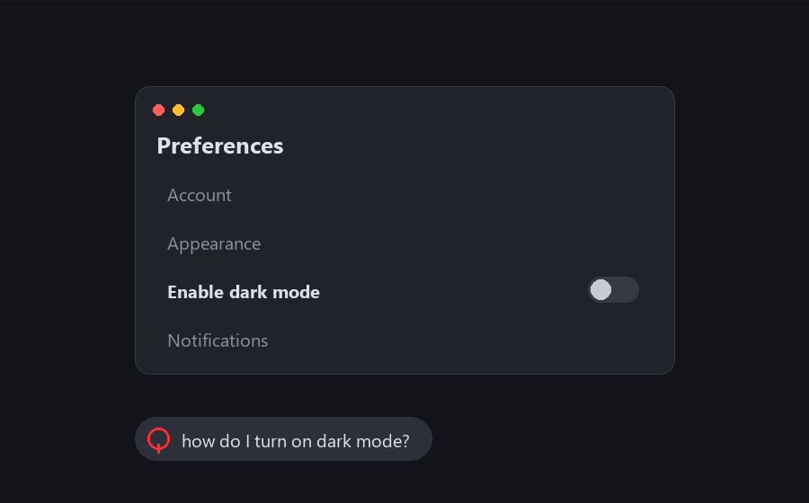

# Halo

**Ask your AI coding agent *"what do I click?"* — and a big red circle appears on your real
screen, over the exact UI element.** Works with both **Claude Code** and **Codex**, because
Halo ships as a standard **MCP server**.



> The macOS world has this (Clicky, Screen Annotations); Windows didn't — unless you have a
> Copilot+ NPU. Halo fills that gap for Windows + Claude Code / Codex.

---

## How it works

```
┌──────────┐  MCP (stdio)  ┌──────────────────┐  HTTP 127.0.0.1:7333  ┌──────────────────┐
│  Agent   │◄─────────────►│  Halo MCP server │──────────────────────►│  Overlay renderer │
│ (Claude/ │  take_screenshot│  (python, stdio) │   POST /circle /clear │  (PySide6, GUI,   │
│  Codex)  │  highlight/clear│                  │                       │  always-on-top)   │
└──────────┘               └──────────────────┘                       └──────────────────┘
                                 captures screen (mss)                    draws the red ring
```

1. The agent calls **`take_screenshot`** — Halo captures your primary display, downscales it to
   fit the token budget, and hands the agent the image plus the `scale` it used.
2. The agent looks at the image, decides which pixel you should click, and calls
   **`highlight(x, y, label="Click here")`** with the coordinate *as it appears in that image*.
3. Halo converts image-space → physical-screen pixels and tells a transparent, click-through,
   always-on-top overlay to draw a labeled ring there. It fades out after a few seconds.

Two processes because an MCP server dies with each agent session, but a GUI overlay must
persist and own a Qt event loop. They talk over localhost HTTP + JSON — language-agnostic and
trivially `curl`-testable.

## The hard part: coordinate fidelity

Windows scales UI (125% / 150% / 200%). A screenshot is in **physical** pixels; a naive Qt
window draws in **logical** pixels; a downscaled screenshot is in a **third** space. Get any
conversion wrong and the circle lands in the wrong place. Halo pins everything to **physical
pixels**:

- Both processes are **Per-Monitor-v2 DPI aware** (`SetProcessDpiAwarenessContext(-4)`).
- Qt's own high-DPI auto-scaling is **disabled** (`QT_ENABLE_HIGHDPI_SCALING=0`) so 1 Qt unit
  equals 1 physical pixel — matching `mss`.
- `take_screenshot` returns a `scale`; `highlight` multiplies by `1/scale` before drawing (the
  "coordinate handshake"), so a pixel picked on a 1280-wide thumbnail lands correctly on a 4K
  display.

Verified **exact** on a 3840×2160 primary at **200%** scaling, from a 1280-px screenshot.

---

## Install

Requires Python 3.11+ on Windows.

```powershell
cd H:\vscode\halo
python -m venv .venv
.\.venv\Scripts\activate
pip install -r requirements.txt
python -m overlay          # M0 check: a transparent, always-on-top window opens
```

## Register with your agent

> **Use the absolute path to `mcp_server/__main__.py`, not `-m mcp_server`.** The VS Code
> extension launches MCP servers from the *workspace root*, where `-m mcp_server` fails with
> `No module named mcp_server`. The absolute script path is cwd-independent and works everywhere.

**Claude Code:**
```powershell
claude mcp add-json -s user halo '{"type":"stdio","command":"H:/vscode/halo/.venv/Scripts/python.exe","args":["H:/vscode/halo/mcp_server/__main__.py"],"cwd":"H:/vscode/halo"}'
```
Then reload the VS Code window / start a new chat. Verify with `claude mcp list` → `halo ✓ Connected`.

**Codex** — add to `~/.codex/config.toml`:
```toml
[mcp_servers.halo]
command = "H:/vscode/halo/.venv/Scripts/python.exe"
args = ["H:/vscode/halo/mcp_server/__main__.py"]
cwd = "H:/vscode/halo"
```
Then start a new Codex session. Templates for both live in [`config/`](config/).

The MCP server auto-launches the overlay the first time it's needed, so there's nothing else
to start.

### Or use the skill (Claude Code, no MCP)

If you'd rather not depend on the MCP connection, Halo also ships as a **Claude Code skill**
that drives the same overlay through a plain CLI (`cli.py`) over Bash — no MCP tools required.
Install it once:

```powershell
mkdir $HOME\.claude\skills\halo
copy skill\SKILL.md $HOME\.claude\skills\halo\SKILL.md
```

Then in any Claude Code chat just ask *"what do I click?"* — the skill runs
`python cli.py screenshot` / `highlight X Y` for you. The MCP server remains the path for Codex
(which has no skill system); the two share the overlay and the coordinate handshake.

## Use it

Just ask, in either agent:

> *"What do I click to change the theme?"*

The agent screenshots, reasons, and Halo circles the button on your screen. Follow-ups like
*"a bit lower"* work too — it just calls `highlight` again.

---

## Tools (MCP)

| Tool | What it does |
|---|---|
| `take_screenshot(window_title?)` | Capture the primary display; returns the (downscaled) PNG + native `width`/`height` + `scale`. |
| `highlight(x, y, label?, shape?, radius?, color?, ttl_ms?, coord_space?)` | Draw a `circle` (default), `box`, or `arrow`. Coords default to `image` space (converted via the handshake); pass `coord_space="physical"` for raw screen pixels. |
| `clear()` | Remove all annotations immediately. |
| `ping_overlay()` | Health-check the overlay; launch it if it's down. |

The overlay also exposes a plain HTTP API (`POST /circle /box /arrow /clear`, `GET /health`) on
`127.0.0.1:7333` — see [`tests/test_overlay_curl.md`](tests/test_overlay_curl.md).

## Standalone overlay (no Python needed)

The overlay can run as a one-file Windows executable, so non-developers don't need a Python
env. Grab `halo-overlay.exe` from the [Releases](https://github.com/masternazz/halo-windows/releases)
page and run it — it listens on `127.0.0.1:7333` just like `python -m overlay`. Drop a
`settings.json` next to the .exe to change hotkeys/colors/token budget.

Build it yourself:
```powershell
pip install pyinstaller
python build.py          # -> dist/halo-overlay.exe (~48 MB, windowed)
```
(The MCP server / CLI still run from the agent's Python env; they auto-launch whichever overlay
they find — the .exe is just a dev-env-free alternative. First launch unpacks to temp, so it
can take a few seconds; SmartScreen may warn on an unsigned exe.)

## Testing

- Overlay smoke tests: [`tests/test_overlay_curl.md`](tests/test_overlay_curl.md)
- DPI / coordinate fidelity: [`tests/test_coords.md`](tests/test_coords.md)
- End-to-end MCP round-trip: `python tests/mcp_client_test.py`

## Limitations (v1)

- **Primary display only.** Multi-monitor is intentionally out of scope for v1.
- **Exclusive-fullscreen apps/games** can draw over the topmost overlay; use borderless-windowed.
  Fine for the target use case (installers, web UIs, dialogs, IDEs).
- On Windows the overlay's lifetime is tied to the agent session that launched it; it
  re-launches automatically each session. Start `python -m overlay` manually for an always-on
  instance.

## Stack

Python 3.11+ · [PySide6](https://doc.qt.io/qtforpython/) (overlay) ·
[mss](https://github.com/BoboTiG/python-mss) + [Pillow](https://python-pillow.org/) (capture) ·
[MCP Python SDK](https://github.com/modelcontextprotocol/python-sdk) (FastMCP, stdio).

See [PLAN.md](PLAN.md) for the full architecture, the coordinate traps, and the build log.
